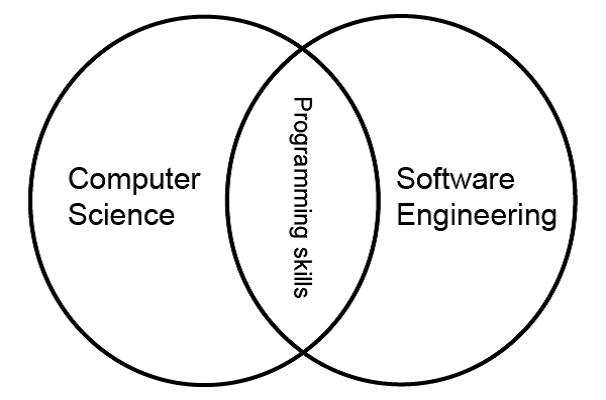
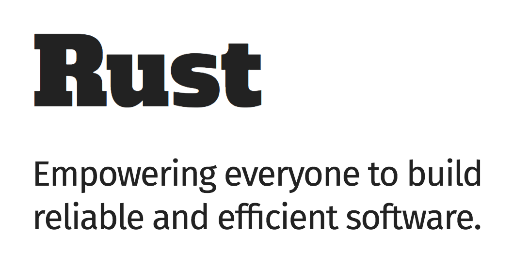
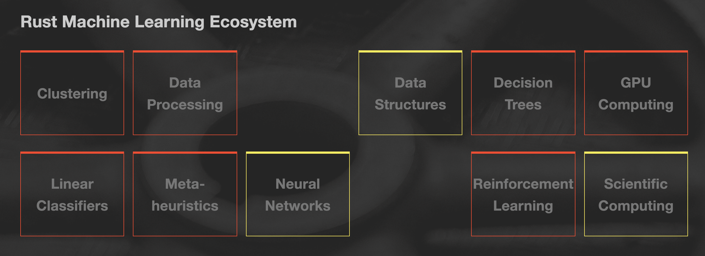

% Rust for scientists with deadlines

# Who am I?

## Gabriela Surita

* Computer Engineer - UNICAMP
* Engineering Specialist - Loggi
* Work at dispatch optimization


# Introduction

## What's computer science?



. . .

Computer science is the study of "automating algorithmic processes that scale" (Owen Astrachan)

. . .

Computer Science x Software Engieneering

---


* CRUD APIs
* User Interfaces
* Logging Infrastructure
* File parsers
* Database modelling

. . .

x

* CPU scheduling
* Dispatch optimization
* Fraud detection
* Credit analysis


## What's the difference?

. . .

* Strong algorithms background
* Data structures
* Heuristics and meta-heuristics
* Data analysis
* Proofs

. . .

**Scientific method**


# Are we scientific yet?

## Fast, expressive and reliable




## Are we learning yet?

. . .



http://www.arewelearningyet.com/

---


## Scientific programming takes time

. . .

* Usually needs to be backed by very large companies

. . .

* It's hard to make what's fast faster


## So what?

. . .

Should I do scientific computing in Rust?


---

Do you have to optimize?

. . .

Would you use C/C++?

. . .

Are you Ok with some glueing?


## Can I benefit from using Rust?

. . .

Probably **no if**:

* There's already an efficient compiled implementations for several steps of your problem.
* You can express your problem in terms of efficient high level APIs (such vector operations)

---

Probably **yes if**:

* You are implementing a yet not implemented algorithm
* You are reimplementing code in a compiled language


# Resources

##


## Don't count to much with external libraries

But other LLVM languages are always available.

## Data Structures

### Ndarray

The ndarray crate provides an n-dimensional container for general elements and for numerics.

https://docs.rs/ndarray/0.12.1/ndarray/

## Linear Algebra

### nalgebra

Linear algebra library with transformations and statically-sized or dynamically-sized matrices.

### ndarray-linalg
Linear algebra package for rust-ndarray using LAPACK


https://www.nalgebra.org/rustdoc/nalgebra/index.html

## Graphs

### petgraph

petgraph is a graph data structure and algorithms library.

https://docs.rs/petgraph/0.4.13/petgraph/


## Visualization

### Jupyter Rust Kernel

https://github.com/google/evcxr/tree/master/evcxr_jupyter


## Ok, I'm doing it in Rust

---

### Do it only in Rust

* Using external LLVM resources
* Jupyter notebooks might help

. . .

Follow your flagship science language (Python, R, ...)

* [https://pyo3.rs/master/](https://pyo3.rs/master/)
* [https://rustr.org/](https://rustr.org/)


# Integrating Rust with Python's scientific toolkit

## PyO3 and PyO3-pack are awesome

```toml
[package]
name = "my-package"
version = "0.1.0"
authors = ["Gabriela Surita <gabsurita@gmail.com>"]
edition = "2018"

[lib]
name = "my_lib"
crate-type = ["cdylib"]
```

---

```rust
#![feature(specialization)]

use pyo3;
use pyo3::wrap_function;
use pyo3::prelude::*;


#[pyfunction]
fn sum(array: Vec<f64>) -> f64 {
    array.iter().sum()
}


#[pymodinit]
fn my_lib(_py: Python, m: &PyModule) -> PyResult<()> {
    m.add_function(wrap_function!(sum)).unwrap();
    Ok(())
}
```

---


```bash
$ pyo3-pack
pyo3-pack 0.4.2
konstin <konstin@mailbox.org>
Build and publish crates with pyo3 bindings as python packages

USAGE:
    pyo3-pack <SUBCOMMAND>

FLAGS:
    -h, --help       Prints help information
    -V, --version    Prints version information

SUBCOMMANDS:
    build          Build the crate into wheels
    develop        Installs the crate as module in the current virtualenv so you can import it
    help           Prints this message or the help of the given subcommand(s)
    list-python    Searches and lists the available python installations
    publish        Build and publish the crate as wheels to pypi
```

## Save copyies, use Numpy

---

```rust
#![feature(specialization)]

use pyo3;
use pyo3::wrap_function;
use pyo3::prelude::*;
use numpy::PyArray1;


#[pyfunction]
fn sum(array: &PyArray1<f64>) -> f64 {
    array.as_array().sum()
}


#[pymodinit]
fn my_lib(_py: Python, m: &PyModule) -> PyResult<()> {
    m.add_function(wrap_function!(sum)).unwrap();
    Ok(())
}
```


## Pratical example

---


---

### Python Reference

scipy.optimize.linear_sum_assignment

### Rust alternative

https://docs.rs/hungarian/1.1.0/hungarian/


---

#![feature(specialization)]


```rust
use pyo3;
use pyo3::wrap_function;
use pyo3::prelude::*;
use hungarian::minimize;
use numpy::PyArray2;


#[pyfunction]
fn hungarian(m: &PyArray2<u32>) -> Vec<Option<usize>> {
    let costs = m.as_slice();
    let n = arr.len();
    let m = if n > 0 { arr[0].len() } else {0};

    minimize(costs, n, n)
}


#[pymodinit]
fn lap_rust(_py: Python, m: &PyModule) -> PyResult<()> {
    m.add_function(wrap_function!(hungarian)).unwrap();
    Ok(())
}

```

---

```python
import numpy as np
from scipy.optimize import linear_sum_assignment

import lap_rust

mat = (np.random.rand(400, 400) * 100).astype(np.uint32)
```

```
%timeit linear_sum_assignment(mat)
38.6 ms per loop (mean ± std. dev. of 7 runs, 1 loop each)

%timeit lap_rust.hungarian(mat)
3.87 ms per loop (mean ± std. dev. of 7 runs, 1 loop each)
```

## Hands on example

Counting sort


# Thanks

## Contacts

* Github: @gabisurita
* Twitter: @gssurita
* Email: gabsurita@gmail.com
